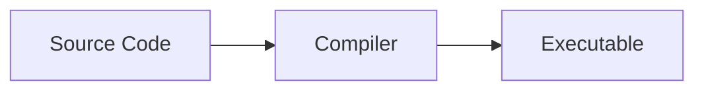
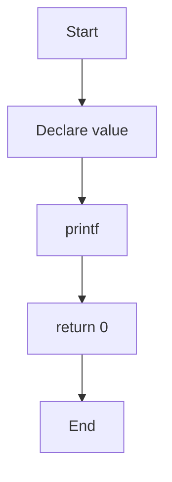

# Typora Test

Bu belge **Typora**, **GitHub** ve daha sonra **MkDocs + Material** uyumluluğunu test etmek için hazırlanmıştır.

---

## 1. C Code Test

Aşağıdaki örnek C kod bloğunda syntax highlighting özelliğini test ediyoruz.

```c
#include <stdio.h>

int main(void)
{
    int value = 42;

    printf("Value: %d\n", value);

    return 0;
}
```

---

## 2. C23 Test Table

| Özellik          | C17                     | C23      |
| ---------------- | ----------------------- | -------- |
| `bool`           | `<stdbool.h>` üzerinden | Keyword  |
| `true` / `false` | `<stdbool.h>` üzerinden | Keyword  |
| `nullptr`        | Yok                     | Var      |
| Binary literal   | Yok                     | `0b1010` |

---

## 3. Task List Test

- [x] Typora kuruldu
- [x] Markdown dosyası oluşturuldu
- [ ] GitHub testi
- [ ] MkDocs testi
- [ ] GitHub Pages testi

---

## 4. Blockquote Test

> C öğrenirken amaç yalnızca çalışan kod yazmak değil, kodun neden çalıştığını da anlamaktır.

---

## 5. Mermaid Test



---

## 6. C Program Flow



---

## 7. Inline Code Test

C programının giriş noktası `main()` fonksiyonudur.

Örneğimizde `printf()` fonksiyonu kullanılıyor ve başlık dosyası olarak `<stdio.h>` ekleniyor.

Derleme örneği:

```bash
gcc -std=c23 -Wall -Wextra -Wpedantic -g -O0 main.c -o main.exe
```

---

## 8. Link Test

[Typora](https://typora.io/)

[GitHub](https://github.com/)

[MkDocs](https://www.mkdocs.org/)

---

## 9. Formatting Test

**Bold text**

*Italic text*

~~Strikethrough~~

`inline code`

---

## 10. Nested List Test

- C
  - Variables
  - Expressions
  - Statements
  - Functions
  - Pointers
    - Address
    - Dereference
    - Pointer arithmetic
- Python
- C++

---

# Test Complete

Bu dosya ileride aynı kaynak kullanılarak:

**Typora → GitHub → MkDocs + Material → GitHub Pages**

akışında kullanılacaktır.

## 11. Deployment Test

Bu satır Typora'da yazıldı, Git ile kaydedildi ve GitHub Pages'e gönderildi.

